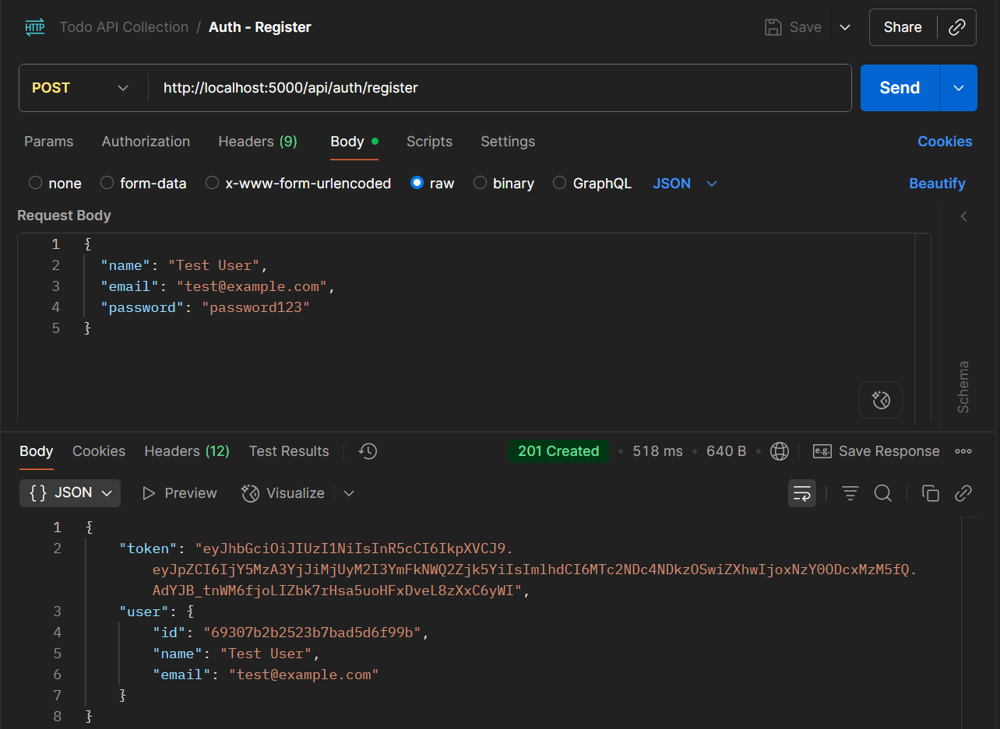
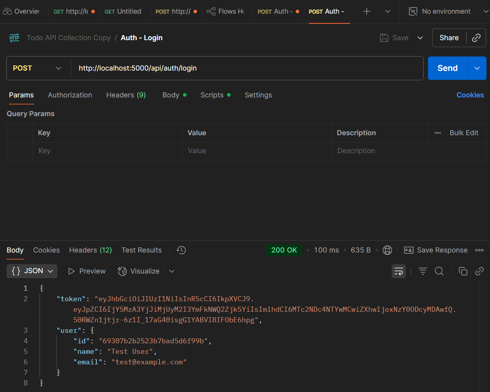
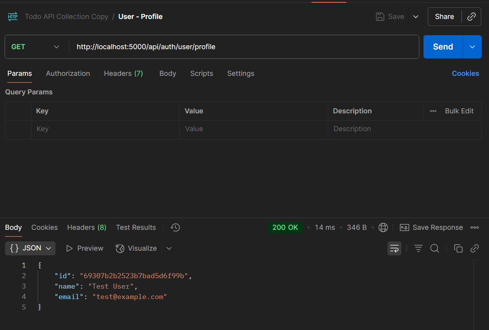
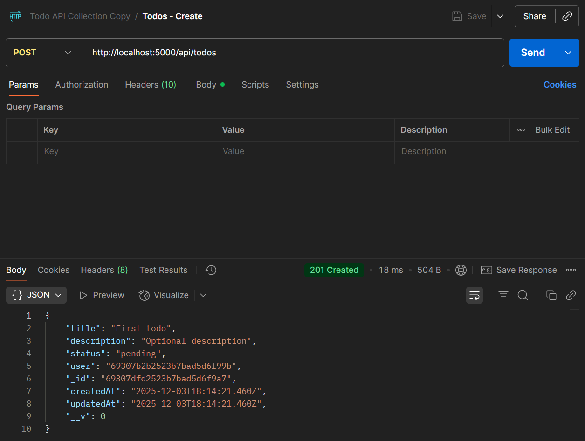
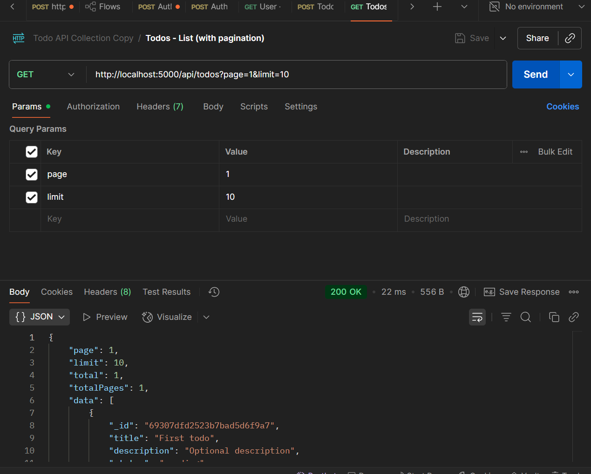
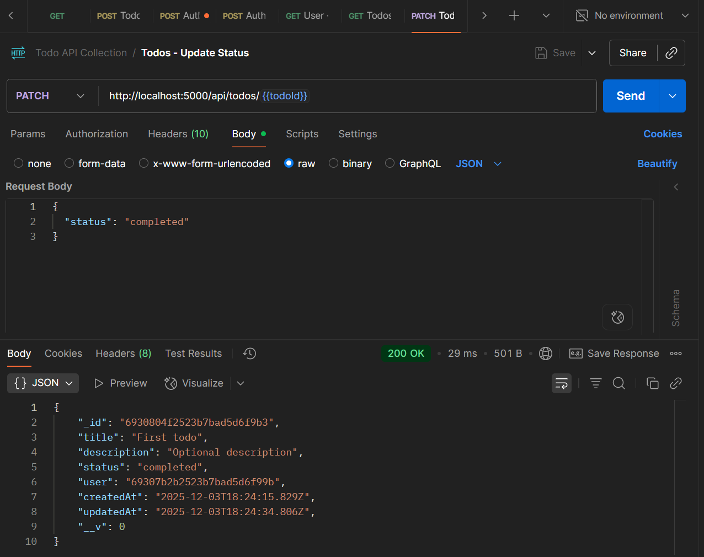
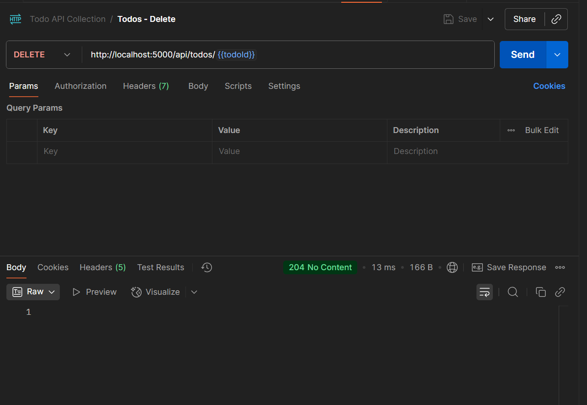

## User & Todo Management API (Node.js + Express + MongoDB)

This project is a small **User & Todo Management** system with:

- **Backend**: Node.js, Express, MongoDB (Mongoose), JWT auth, MVC structure  
- **Frontend**: React + Vite SPA that consumes the API  
- **Extras**: Centralized error handling, rate limiting on auth routes, dotenv config, pagination, Dockerfile, and Postman collection

---

## 1. Project Structure

- `backend/` – Node/Express API
  - `src/config/config.js` – dotenv-based configuration
  - `src/models/User.js`, `src/models/Todo.js` – Mongoose models
  - `src/controllers/` – `authController.js`, `todoController.js`
  - `src/routes/` – `authRoutes.js`, `todoRoutes.js`
  - `src/middleware/` – auth, error handler, rate limiter
  - `server.js` – app entrypoint
  - `Dockerfile` – containerization for backend
  - `TodoAPI.postman_collection.json` – Postman collection
- `frontend/` – React (Vite) SPA
  - `src/App.jsx` – main UI (auth + todos)
  - `src/main.jsx` – React entry
  - `src/style.css` – modern, responsive styling

---

## 2. Setup Instructions

### 2.1 Prerequisites

- Node.js 18+ 
- npm
- MongoDB running locally 

### 2.2 Backend Setup

```bash
cd backend
npm install
```

Create a `.env` file in `backend/` (or adjust values as you like):

```bash
PORT=5000
MONGO_URI=mongodb://127.0.0.1:27017/todo_api
JWT_SECRET=supersecret_jwt_key
JWT_EXPIRES_IN=1d
```

Run the backend:

```bash
cd backend
npm start        # or: npm run dev (if you add nodemon)
```

The API will be available at: `http://localhost:5000`.

### 2.3 Frontend Setup

```bash
cd frontend
npm install
npm run dev
```

Vite will show a URL like `http://localhost:5173`. Open that in the browser.

The frontend expects the API at `http://localhost:5000` (see `frontend/src/App.jsx`).

---

## 3. API Endpoints

All routes are prefixed from the backend base URL: `http://localhost:5000`.

### 3.1 Auth Routes

- **Register**
  - **URL**: `POST /api/auth/register`
  - **Body**:
    ```json
    {
      "name": "Test User",
      "email": "test@example.com",
      "password": "password123"
    }
    ```
  - **Response (201)**:
    ```json
    {
      "token": "JWT_TOKEN_HERE",
      "user": {
        "id": "USER_ID",
        "name": "Test User",
        "email": "test@example.com"
      }
    }
    ```

- **Login**
  - **URL**: `POST /api/auth/login`
  - **Body**:
    ```json
    {
      "email": "test@example.com",
      "password": "password123"
    }
    ```
  - **Response (200)**: same shape as register.

- **Get Profile**
  - **URL**: `GET /api/auth/user/profile`
  - **Headers**: `Authorization: Bearer <JWT_TOKEN>`
  - **Response (200)**:
    ```json
    {
      "id": "USER_ID",
      "name": "Test User",
      "email": "test@example.com"
    }
    ```

> **Rate Limiting**: `/api/auth/register` and `/api/auth/login` are protected by a rate limiter (see `src/middleware/rateLimitMiddleware.js`).

### 3.2 Todo Routes (Protected)

All todo routes require `Authorization: Bearer <JWT_TOKEN>`.

- **Create Todo**
  - **URL**: `POST /api/todos`
  - **Body**:
    ```json
    {
      "title": "First todo",
      "description": "Optional description"
    }
    ```
  - **Response (201)**: created todo document.

- **List Todos with Pagination**
  - **URL**: `GET /api/todos?page=1&limit=10`
  - **Query**:
    - `page` – page number (default `1`)
    - `limit` – items per page (default `10`)
  - **Response (200)**:
    ```json
    {
      "page": 1,
      "limit": 10,
      "total": 1,
      "totalPages": 1,
      "data": [
        {
          "_id": "TODO_ID",
          "title": "First todo",
          "description": "Optional description",
          "status": "pending",
          "user": "USER_ID",
          "createdAt": "2025-01-01T00:00:00.000Z",
          "updatedAt": "2025-01-01T00:00:00.000Z"
        }
      ]
    }
    ```

- **Update Todo Status**
  - **URL**: `PATCH /api/todos/:id`
  - **Body**:
    ```json
    {
      "status": "completed"
    }
    ```
  - **Response (200)**: updated todo document.

- **Delete Todo**
  - **URL**: `DELETE /api/todos/:id`
  - **Response (204)**: no content.

Each todo is always scoped to the **logged-in user**; you cannot modify another user’s todos.

---

## 4. Error Handling & Middleware

- **Error Handler**: `src/middleware/errorMiddleware.js` – catches errors and sends JSON:
  ```json
  {
    "message": "Error message here"
  }
  ```
- **JWT Auth Middleware**: `src/middleware/authMiddleware.js` – validates JWT, loads user, attaches `req.user`.
- **Rate Limiter**: `src/middleware/rateLimitMiddleware.js` – applied on auth routes to avoid brute-force attacks.

---

## 5. Postman / Thunder Client

- **Postman Collection**: `backend/TodoAPI.postman_collection.json`
  - Import this file into Postman (or Thunder Client) to get ready-made requests for:
    - Register
    - Login
    - Profile
    - Create / List / Update / Delete todos
  - The collection uses variables like `{{token}}` and `{{todoId}}` for convenience.

---

## 6. Postman Screenshots

Screenshots of API responses from Postman:

### 6.1 Auth Endpoints

#### Register


#### Login


#### Get Profile


### 6.2 Todo Endpoints

#### Create Todo


#### List Todos (with Pagination)


#### Update Todo Status


#### Delete Todo


> **Note**: To add screenshots:
> 1. Take screenshots in Postman showing the request and response
> 2. Save them in the `screenshots/` folder with descriptive names (e.g., `register.png`, `login.png`)
> 3. Update the image paths above to match your screenshot filenames

---

## 7. Docker (Backend)

`backend/Dockerfile` builds a production image for the API:

```bash
cd backend
docker build -t todo-backend .
docker run -p 5000:5000 --env-file .env todo-backend
```

Ensure your `MONGO_URI` in `.env` points to a MongoDB instance reachable from inside the container (e.g. a Docker network or a cloud MongoDB URI).


